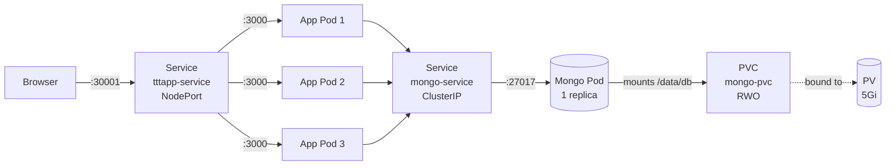

Architecture with added PVC and PV

```mermaid
flowchart LR
    B["Browser"] -- ":30001" --> S["Service<br/>tttapp-service<br/>NodePort"]
    S -- ":3000" --> P1["App Pod 1"]
    S -- ":3000" --> P2["App Pod 2"]
    S -- ":3000" --> P3["App Pod 3"]
    P1 --> M["Service<br/>mongo-service<br/>ClusterIP"]
    P2 --> M
    P3 --> M
    M -- ":27017" --> DB[("Mongo Pod<br/>1 replica")]
    DB -- "mounts /data/db" --> PVC["PVC<br/>mongo-pvc<br/>RWO"]
    PVC -. "bound to" .-> PV[("PV<br/>5Gi")]
```
