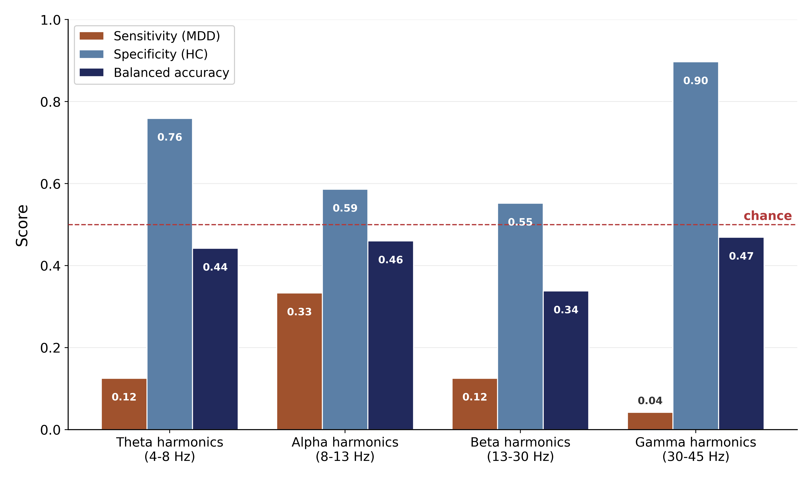
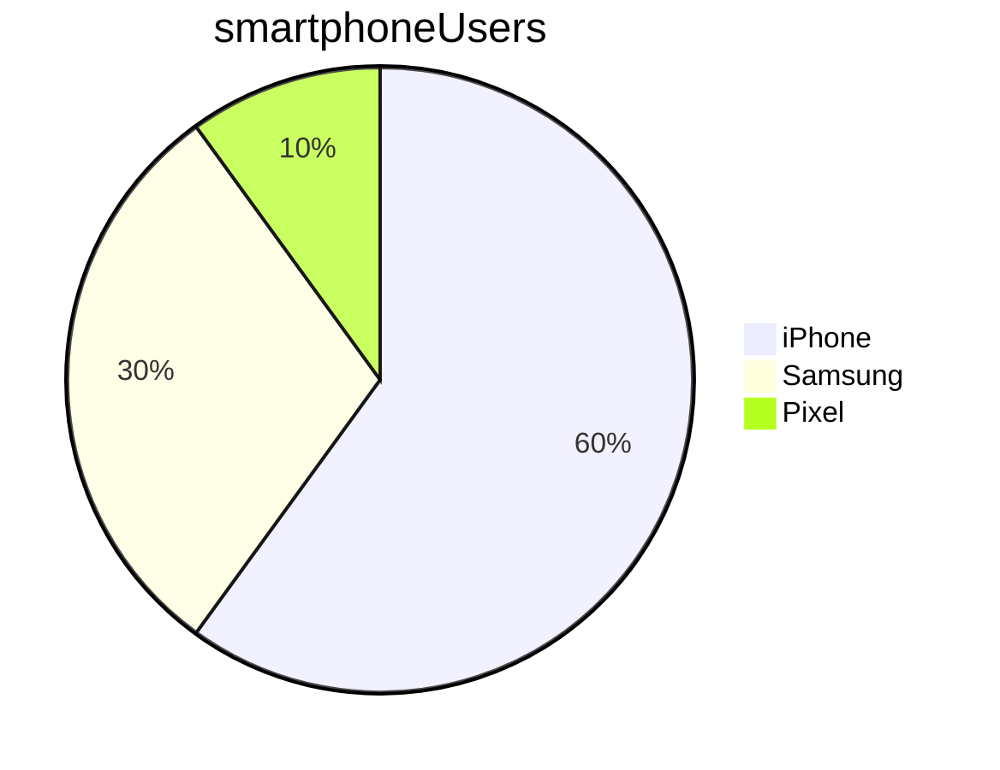

# Tech613 Learning

- [Tech613 Learning](#tech613-learning)
  - [Markdown](#markdown)
    - [Lists](#lists)
  - [Marking code](#marking-code)
    - [Task list](#task-list)
    - [Tables](#tables)
    - [Mermaid](#mermaid)

## Markdown

more hashes =smaller heading
### Lists
- item 1
- item2
  
for break
<br> 

example 3
* item 1
  * sub point 
- 1.item 2
* item 2

*italics*
or cntrl i
**bold**
or cntrl 
italic and bold



## Marking code

With python, use 'print' to display text on the screen

For a block of code:
```python
print("Hello")

```

```bash
mkdir folder_to_make
```

### Task list

  * [ ] 1
  * [ ] 2
  * [ ] .

### Tables
Name    |   Street   |  Town
--------|------------|----------
Cathy   | Main St    | Birmingham
John    | Maple Drive  | Stafford

### Mermaid



